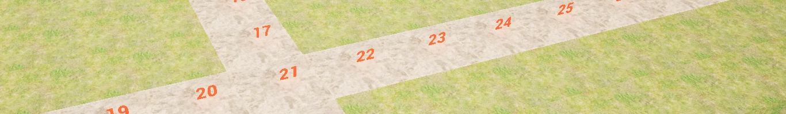

#### FR

J’adore lire des livres sur la programmation.
L’un de mes préférés est **Programming Game AI by Example de Mat Buckland**.

Dans ce livre, il explique différents algorithmes de recherche de chemin dans un graphe de nœuds, ce qui m’a inspiré à créer un projet où je pouvais implémenter quelque chose de similaire.

#### EN

I love reading books about programming.
One of my favorites is **Programming Game AI by Example by Mat Buckland**.

In this book, he discusses various pathfinding algorithms in node graphs, which inspired me to create a project where I could implement something similar.

### Code
```C++
//----------------------- IndexedPriorityQLow ---------------------------
//
//  Priority queue based on an index into a set of keys. The queue is
//  maintained as a 2-way heap.
//
//  The priority in this implementation is the lowest valued key
//
// Class based on Mat Buckland's book
//------------------------------------------------------------------------
template<class KeyType>
class TDIndexedPriorityQLow
{
private:

    TArray<KeyType>&    m_vecKeys;
    TArray<int>         m_heap;
    TArray<int>         m_invHeap;
    int                 m_iSize,
                        m_iMaxSize;

    void Swap(int a, int b)
    {
        int temp = m_heap[a]; m_heap[a] = m_heap[b]; m_heap[b] = temp;

        //change the handles too
        m_invHeap[m_heap[a]] = a; m_invHeap[m_heap[b]] = b;
    }

    void ReorderUpwards(int nd)
    {
        //move up the heap, swapping the elements until the heap is ordered
        while ((nd > 1) && (m_vecKeys[m_heap[nd / 2]] > m_vecKeys[m_heap[nd]]))
        {
            Swap(nd / 2, nd);

            nd /= 2;
        }
    }

    void ReorderDownwards(int nd, int HeapSize)
    {
        //move down the heap from node nd, swapping the elements until
        //the heap is reordered
        while (2 * nd <= HeapSize)
        {
            int child = 2 * nd;

            //set child to the smaller of nd's two children
            if ((child < HeapSize) && (m_vecKeys[m_heap[child]] > m_vecKeys[m_heap[child + 1]]))
            {
                ++child;
            }

            //if this nd is larger than its child, swap
            if (m_vecKeys[m_heap[nd]] > m_vecKeys[m_heap[child]])
            {
                Swap(child, nd);

                //move the current node down the tree
                nd = child;
            }

            else
            {
                break;
            }
        }
    }


public:

    //you must pass the constructor a reference to the std::vector, the PQ
    //will be indexing int and the maximum size of the queue.
    TDIndexedPriorityQLow(TArray<KeyType>& keys, int MaxSize) :
        m_vecKeys(keys),
        m_iSize(0),
        m_iMaxSize(MaxSize)
    {
        m_heap.Init(0, MaxSize + 1);
        m_invHeap.Init(0, MaxSize + 1);
    }

    bool IsEmpty()const { return (m_iSize == 0); }

    //to insert an item into the queue, it gets added to the end of the heap
    //and then the heap is reordered from the bottom up.
    void Insert(const int32 idx)
    {
        check(m_iSize + 1 <= m_iMaxSize);

        ++m_iSize;

        m_heap[m_iSize] = idx;

        m_invHeap[idx] = m_iSize;

        ReorderUpwards(m_iSize);
    }

    //to get the min item the first element is exchanged with the lowest
    //in the heap and then the heap is reordered from the top down. 
    int Pop()
    {
        Swap(1, m_iSize);

        ReorderDownwards(1, m_iSize - 1);

        return m_heap[m_iSize--];
    }

    //if the value of one of the client key's changes then call this with 
    //the key's index to adjust the queue accordingly
    void ChangePriority(const int idx)
    {
        ReorderUpwards(m_invHeap[idx]);
    }
};

struct FPFNodeTopLeftToBottomRight
{
    bool operator()(const UCPathFindingNode& A, const UCPathFindingNode& B) const;
};

bool FPFNodeTopLeftToBottomRight::operator()(const UCPathFindingNode& A, const UCPathFindingNode& B) const
{
    if (IsValid(&A) && IsValid(&B))
    {
        FVector lLocA = A.GetNodeLocation();
        FVector lLocB = B.GetNodeLocation();

        //If Xs are same check Ys
        //Low Y goes to the left, Big Y goes to the Right
        if (lLocB.X == lLocA.X)
        {
            return lLocB.Y > lLocA.Y;
        }

        //Big X goes to Top Low X goes to Bottom
        return lLocA.X > lLocB.X;
    }
    return false;
}
```
- [Watch the video](https://youtu.be/v-Gn-4eGuCI)
- [Base Readme](https://github.com/Opaax/Opaax.github.io/blob/main/AStartPF.md)
- [Full Code repo](https://github.com/Opaax/EnguerranCobertPortfolio/tree/main/Pathfinding)
- 👉 [Home](./).
