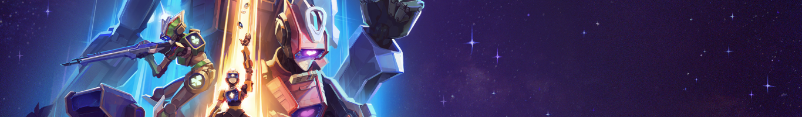

English version below.

#### FR

Bet’N’Die est mon projet de fin d’études à Isart Digital. Ce projet a été développé sur une version personnalisée d’Unreal Engine 4.26.
Nous avons créé cette version custom afin de permettre un build vers AWS. En effet, nos serveurs étaient hébergés sur AWS grâce au partenariat entre AWS et Isart Digital.
Pour le versioning, nous utilisions Perforce.

Ce projet était pensé comme une mini-production, simulant le fonctionnement d’un petit studio.
Il a duré environ 10 mois, ponctués de plusieurs milestones :

- POC
- 3C
- Alpha
- Beta
- Gold
  
## Équipe

Nous étions une équipe de 20 personnes :

- 2 Producers
- 4 Game Designers
- 4 Programmeurs Moteur
- 3 Programmeurs Gameplay/UI
- 2 Sound Designers
- 3 Artistes 2D
- 2 Artistes 3D

## Pitch

Dans un futur lointain, une compétition unique a vu le jour : le Bet ’n’ Die.
C’est l’événement sportif interplanétaire incontournable, où les parieurs les plus téméraires s’affrontent dans une arène-casino en pilotant des robots de combat, mettant en jeu leur honneur et leur fortune.

## Concept

L’idée initiale était de mélanger le poker avec un FPS.
Avec le temps, l’aspect poker s’est estompé, mais nous avons conservé l’univers du casino.

Dans ce jeu, éliminer gratuitement vos adversaires ne rapporte pas grand-chose : cela reste un moyen stratégique pour ralentir la progression en jetons des adversaires.
Le vrai cœur du gameplay réside dans les paris, tels que :

- Tous les adversaires meurent en X temps (les kills des autres joueurs comptent).
- Trouver la pastèque : une pastèque spawn dans l’arène, il faut lui tirer dessus. Les autres joueurs peuvent aussi la détruire pour la faire réapparaître ailleurs.
- Etc...

Pour gagner, il faut accumuler un maximum de jetons et les déposer dans la vault, un coffre commun à tous les joueurs.
Les jetons conservés en poche ne comptent pas ! Mais comme la vault est un lieu très convoité, les éliminations y sont fréquentes.

## Mon implication dans le projet

Je fais partie de l’équipe qui a pitché le projet. Entre juin et septembre 2021, nous avons exploré l’idée d’intégrer le poker dans un autre type de jeu (twinstick, FPS).
Finalement, notre USP (Unique Selling Point) s’est fixé sur le concept de pari intégré au FPS.
L’équipe pédagogique d’Isart Digital a sélectionné notre projet pour devenir le projet partenaire AWS, tout en étant le projet le plus ambitieux de la promo.

J’ai réalisé le prototype de notre USP, le Bet Shot, qui permet aux joueurs de parier en cours de partie.
Cette feature a ensuite été reprise par d’autres programmeurs pour l’intégration réseau et l’ajout de paramètres.

En parallèle, je me suis occupé du flow du jeu :

- Depuis le menu principal jusqu’au lancement de la partie.
- Attente des joueurs via le réseau.
- Gestion du lobby.
- Lancement des cinématiques aux bons moments.

J’ai également initié notre menu debug, plus pratique que de simples commandes console.
Ce menu permettait de relancer des parties, changer d’armes, modifier des paramètres runtime, etc. Comme il a été utilisé par toute l’équipe, j’ai pu réutiliser certaines options pour le menu d’options du jeu final.

La majorité de ma production s’est donc concentrée sur les menus et les interfaces :

- Menu principal en 3D.
- Lobby de style Fortnite.
- Interfaces dans les machines de paris.

Pour l’UI, nous étions une équipe de 3 : une artiste UI, un UX designer, et moi en programmeur.

Malheureusement, le jeu n’est plus jouable aujourd’hui car nous n’avons plus de serveurs actifs.

- [Bande annonce](https://www.youtube.com/watch?v=FxrSrZTVpUA)
- [Walkthrough](https://www.youtube.com/watch?v=iQB3cvAuf4o)
- [Zoom sur les menus](https://www.youtube.com/watch?v=PeeU5teId58)
- [Prototype du Betshot](https://www.youtube.com/watch?v=FAA6zQfjZm4)
- [Itch.io](https://isart-digital.itch.io/betndie)

#### En

Bet’N’Die was my graduation project at Isart Digital. It was developed on a custom version of Unreal Engine 4.26.
We built this custom version to allow deployment on AWS, as our servers were hosted there thanks to a partnership between AWS and Isart Digital.
For version control, we used Perforce.
The project was structured like a small studio production and lasted about 10 months, with clear milestones:

- POC
- 3C
- Alpha
- Beta
- Gold

## Team

We were a 20-person team:

- 2 Producers
- 4 Game Designers
- 4 Engine Programmers
- 3 Gameplay/UI Programmers
- 2 Sound Designers
- 3 2D Artists
- 2 3D Artists

## Pitch

In a distant future, a unique competition was born: Bet ’n’ Die.
It is the ultimate interplanetary sporting event, where daring gamblers face off in a casino-like arena, piloting combat robots and wagering both their honor and their fortune.

## Concept

The initial idea was to merge poker with a first-person shooter.
Over time, the poker aspect faded, but the casino theme remained.
In this game, simply eliminating opponents does not provide much reward; it is mainly a strategic way to slow opponents token progression.
The real key to victory lies in bets, such as:

- All opponents die within X time (kills from any player count).
- Find the watermelon: a watermelon spawns in the arena, and players must shoot it. Others can destroy it to force it to respawn elsewhere.
- And more...

To win, players must accumulate tokens and deposit them in the vault, a shared location accessible to all.
Tokens kept in your pocket don’t count! But since the vault is a high-risk spot, eliminations there are frequent.

## My Role in the Project

I was part of the team that originally pitched the project. Between June and September 2021, we explored the idea of merging betting mechanics with FPS gameplay.
Our USP (Unique Selling Point) became the Bet Shot, a feature allowing players to place bets during matches.
I developed the prototype for the Bet Shot, which was later expanded by other programmers for networking and additional parameters.

At the same time, I was responsible for the game flow, including:

- From the main menu to the start of the match.
- Waiting for all players via networking.
- Lobby system.
- Triggering cinematics at the right time.

I also created our debug menu, a user-friendly alternative to console commands.
This tool allowed us to restart matches, swap weapons, adjust runtime parameters, and more.
It became widely used by the entire team, and I later reused some of its features in the final game options menu.

Most of my contribution was focused on menus and UI, such as:

- A fully 3D main menu.
- A Fortnite-style lobby.
- The betting machine interfaces.

For UI, I worked closely with a small team of 3: an UI artist, an UX designer, and myself as the programmer.

Unfortunately, the game is no longer playable since the servers are no longer available.

- [Trailer](https://www.youtube.com/watch?v=FxrSrZTVpUA)
- [Walkthrough](https://www.youtube.com/watch?v=iQB3cvAuf4o)
- [Menu Focus](https://www.youtube.com/watch?v=PeeU5teId58)
- [Prototype Betshot](https://www.youtube.com/watch?v=FAA6zQfjZm4)
- [Itch.io](https://isart-digital.itch.io/betndie)

---

👉 [Home](./).
