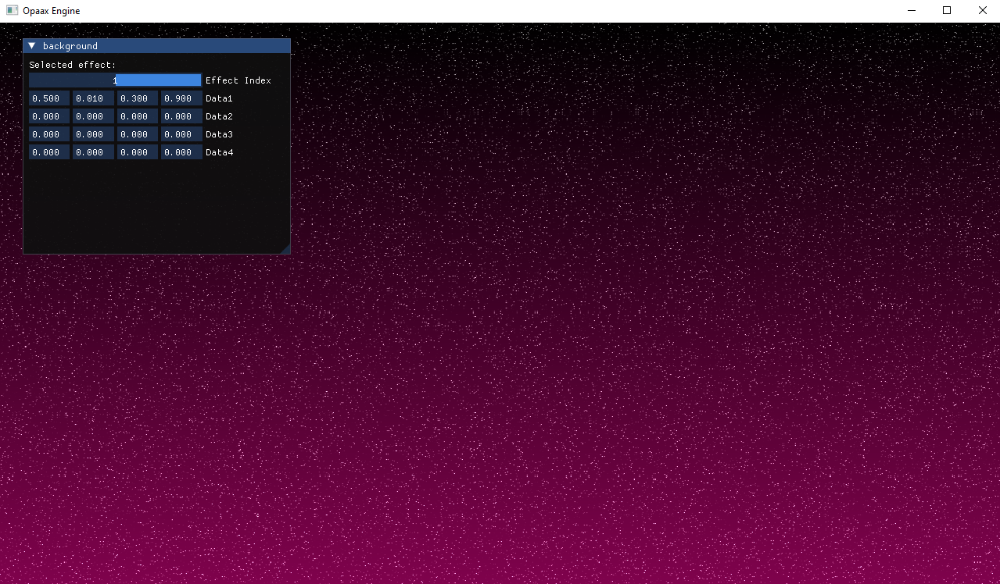

English version below

#### FR

J’ai lancé ce projet parce que je voulais comprendre la programmation bas niveau d’un moteur de jeu. Jusqu’ici, j’avais principalement développé des jeux avec des moteurs existants comme Unity ou Unreal Engine. L’objectif n’est pas de “concurrencer” ces moteurs, mais plutôt d’approfondir mes compétences techniques et ma compréhension des systèmes internes d’un game engine.

J’ai commencé en suivant les cours de Dave Churchill sur la programmation de moteurs de jeu, afin de poser de bonnes bases.
Ensuite, j’ai utilisé SFML pour gérer la partie graphique et j’ai développé un petit jeu inspiré de Geometry Wars.

Par la suite, j’ai ajouté des fonctionnalités comme la gestion de sprites et animations.

Souhaitant aller plus loin techniquement, j’ai ensuite intégré Vulkan pour passer à un vrai pipeline graphique moderne.

Pour progresser davantage, je me suis inspiré de ressources avancées comme :

- Esoterica Prototype Game Engine de Bobby Anguelov
- Enigine de furkansarihan
- Le livre Game Engine Architecture de Jason Gregory

Grâce à cela, j’ai pu structurer et développer progressivement mon propre moteur.

#### EN

I started this project because I wanted to better understand low-level game engine programming. Until now, I mostly developed games using existing engines like Unity and Unreal Engine. This project isn’t meant to “compete” with those engines, but rather to improve my technical knowledge about how game engines work under the hood.

I began by following Dave Churchill’s game engine programming course to build a strong foundation.
Then, I used SFML for the graphics side and developed a small Geometry Wars–style game.

After that, I added support for sprites and animations.

Wanting to go deeper technically, I implemented Vulkan and moved to a modern rendering pipeline.

To keep progressing, I studied advanced resources such as:

- Esoterica Prototype Game Engine by Bobby Anguelov
- Enigine by furkansarihan
- The book Game Engine Architecture by Jason Gregory

This helped me structure and build my own engine step by step.

