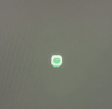
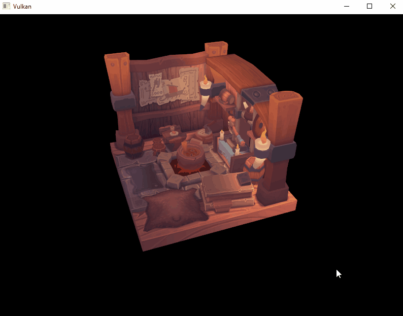

English version below

#### FR

J'ai voulu commencer ce projet car j'ai surtout programmer mes jeux avec des moteurs déjà installer (Unreal, Unity). Ce n'est pas un projet pour "Conccurencer" ces moteurs mais améliorer mes connaissances.

J'ai commencer par suivre les vidéos youtube de Dave Churchill sur ces cours de Game programming et ainsi commencer de la bonne manière. 
J'ai donc commencé avec SFML pour le coté graphique et developper un petit Geometry wars.

J'ai ensuite continué avec des features qui intégre des sprites et des animation.

Par la suite j'ai voulu aller un peut plus loins en implémentant Vulkan.

#### EN

