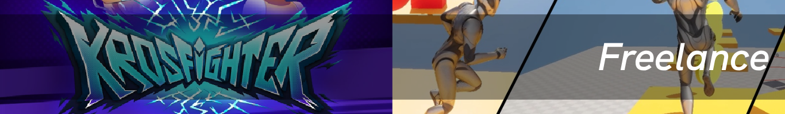
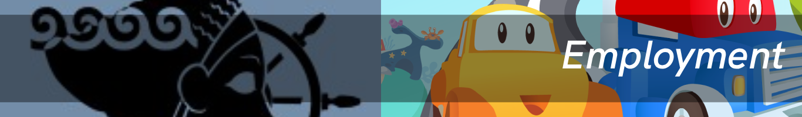
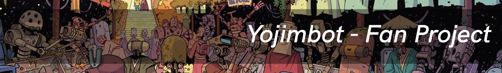

## Enguerran COBERT

- 🎮 Gameplay Programmer (C++, C#)
- 📍 Based in Montréal, Canada
- 📧 enguerran.cobert@gmail.com
  
#### FR

Je suis Enguerran COBERT, développeur gameplay basé à Montréal.
Originaire de Savoie (France), j’ai commencé par des études en électricité puis en Game Art, avant de tomber passionnément dans la **programmation avec Unity et Unreal**.
Aujourd’hui, je crée du gameplay, des outils, et des prototypes, tout en cultivant ma curiosité technique et créative.
En dehors du code, je restaure des montres automatiques, fais de l’escalade, du vélo, et j’aime me ressourcer dans la nature.

[Un peu plus sur moi](aboutme.md)

#### EN

I’m Enguerran COBERT, a gameplay programmer based in Montréal, Canada.
Originally from Savoie, France, I started out studying electricity and Game Art, before discovering my passion for **programming with Unity and Unreal**.
Today, I focus on building gameplay systems, tools, and prototypes, while keeping a strong curiosity for both tech and creativity.
Outside of coding, I enjoy restoring automatic watches, climbing, cycling, and spending time in nature.

[More about Me](aboutme.md)

---

## Experiences

- 🕹️ [Freelance](Freelance.md)

---

- 🕹️ [Employment](Employment.md)
  
---

## Projects

- 🕹️ [A* Pathfinding](AStartPF.md)
  
---

- 🕹️ [Spawn System with Spatial Hashing](SSSH.md)

---

- 🕹️ [Bet'N'Die](BND.md)

---

- 🕹️ [Yojimbot - Fan project](Yojimbot.md)

---

- 🕹️ [Opaax Engine](OpaaxEngine.md)

---

## 🌐 Links
- [LinkedIn](https://linkedin.com/in/enguerran-cobert)
- [Itch.io](https://enguerrancobert.itch.io/)
- [Other Website](https://enguerrancobert.myportfolio.com/)
