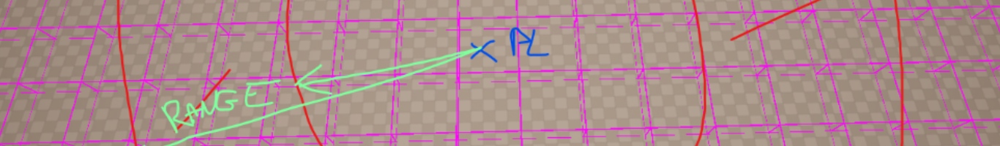
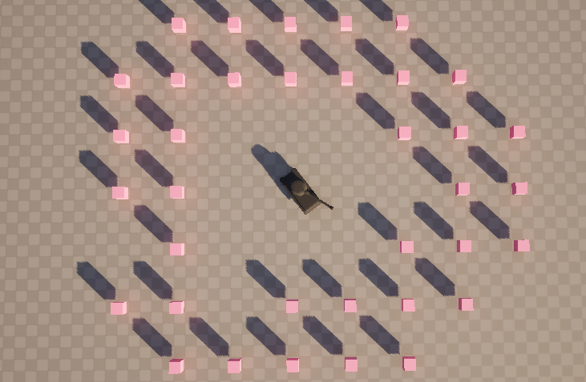

English version below

#### FR

Pour l’un de mes projets, j’avais besoin d’un système de spawn d’ennemis autour du joueur, avec une part de hasard.
J’aurais pu utiliser des fonctions simples comme ```Random::UnitSphere```, mais cela pouvait générer des positions impossibles à utiliser à cause des collisions ou d’autres obstacles.

Pour résoudre ce problème, j’ai pensé au spatial hashing.
Avec ce système, je peux récupérer uniquement les cases valides pour assurer un spawn correct.

#### EN

For one of my projects, I needed an enemy spawn system around the player, with randomness involved.
I could have simply used functions like Random::UnitSphere, but this could generate invalid positions due to collisions or other obstacles.

To solve this, I implemented spatial hashing.
With this system, I can retrieve only valid cells, ensuring enemies always spawn correctly.

---
### Result


### Code
```C++
struct FSpawnGridHandleBase
{
public:
	FVector3d Location;
	int32 GridIndex;

	FSpawnGridHandleBase(): Location(), GridIndex(0) {}
};


template<class HandleType = FSpawnGridHandleBase>
class SpatialHashingHandler
{
	/*
	 * Give compile error if HandleType do not derive from base handle
	 * assure that there is at least a location to work with as the TPointHashGrid3d is supposed to work
	*/
	static_assert(TIsDerivedFrom<HandleType, FSpawnGridHandleBase>::Value, "HandleType must be a type derived from FSpawnGridHandleBase"); 
	/*-------------------------- MEMBERS ----------------------------*/
private:
	UE::Geometry::TPointHashGrid3d<int32>* PointHash3;
	TArray<HandleType*> AllHandle;
	bool bIsClear = true;

	/*-------------------------- FUNCTION ----------------------------*/

public:
	/**
	 * Create the hash grid with the given cell size
	 * @param CellSize The size of each grid cell.
	 * @param InvalidValue The value to mark as invalid in the grid.
	 */
	void CreateGrid(int32 CellSize = 100, int32 InvalidValue = -1)
	{
		PointHash3 =  new UE::Geometry::TPointHashGrid3d<int32>(CellSize, InvalidValue);
		bIsClear = false;
	}

	/**
	 * Reserve memory space for the hash grid to optimize the insertion of a given number of elements.
	 * @param Num The number of elements to reserve space for.
	 */
	void Reserve(int32 Num) const
	{
		PointHash3->Reserve(Num);
	}

	/**
	 * Get the pointer to the hash grid.
	 * @return Pointer to the TPointHashGrid3d<int32> instance.
	 */
	UE::Geometry::TPointHashGrid3d<int32>* GetGrid() const { return PointHash3;}

	/**
	 * Get a copy of all the handles stored in the Spatial Hashing Handler.
	 * @return An array of pointers to the HandleType instances.
	 */
	TArray<HandleType*> GetHandlesCopy() const { return AllHandle;}

	/**
	 * Get a const reference to the array of pointers to stored HandleType instances.
	 * @return Const reference to the array of pointers to HandleType instances.
	 */
	const TArray<HandleType*>& GetHandlesRef() const { return AllHandle;}

	/**
	 * Delete the hash grid and mark as clear if conditions are met.
	 * Deletes the TPointHashGrid3d instance if it exists and clears the state if all handles are empty.
	 */
	void DeleteGrid()
	{
		if(PointHash3 != nullptr)
		{
			delete PointHash3;
		}

		if(AllHandle.IsEmpty())
		{
			bIsClear = true;
		}
	}

	/**
	 * Reset the handles in the grid and set the clear state if the hash grid is not initialized.
	 */
	void ClearGrid()
	{
		AllHandle.Reset();
		
		if(PointHash3 == nullptr)
		{
			bIsClear = true;
		}
	}

	/**
	 * Add a handle to the Spatial Hashing Handler.
	 * @param Handle Pointer to the HandleType instance to be added.
	 * Updates the GridIndex of the handle by adding it to the list of handles and inserts its location into the point hash grid if the handle is not null.
	 */
	void AddHandle(HandleType* Handle)
	{
		if(Handle)
		{
			Handle->GridIndex = AllHandle.Add(Handle);
			PointHash3->InsertPoint(Handle->GridIndex, Handle->Location);
		}
	}

	/**
	 * Flushes the grid data by clearing all handles and deleting the grid.
	 * Clears all handles in the grid, deletes the grid instance, and sets the clear state to true.
	 */
	void FlushGrid()
	{
		ClearGrid();
		DeleteGrid();
		bIsClear = true;
	}


	SpatialHashingHandler(): PointHash3(nullptr) {}
	~SpatialHashingHandler()
	{
		ensureMsgf(bIsClear, TEXT("You should call 'FlushGrid' before deleting SpatialHashingHandler"));
	}

void UTSSpawnManagerComponent::SpawnTest(float MinDist, float MaxDist, UClass* SpawnClass) const
{
	if(UTSSpawnSubsystem* lSSub = GetWorld()->GetSubsystem<UTSSpawnSubsystem>())
	{
		APawn* lPlayerPawn = UGameplayStatics::GetPlayerController(GetWorld(),0)->GetPawn();
		check(lPlayerPawn);
		TArray<ATSSpawnLocationActor*> OutSpawns;
		lSSub->GetSpawnLocationForDistance(lPlayerPawn->GetActorLocation(), MinDist, MaxDist,OutSpawns);

		//TODO Check player movement forward/backward camera view

		ATSSpawnLocationActor* OutSpawn = nullptr;
		int32 OutIndex = -1;
		TankySurvivorUtils::TSArray_Random(OutSpawns, OutSpawn,OutIndex);
		if(ensure(OutSpawn))
		{
			FTransform lTransform{OutSpawn->GetTransform()};
			FActorSpawnParameters lParams;
			lParams.ObjectFlags = RF_Transient;
			lParams.Owner = GetOwner();
		
			GetWorld()->SpawnActor<AActor>(SpawnClass,lTransform,lParams);
		}
	}
}

void UTSSpawnManagerComponent::InitializeComponent()
{
	Super::InitializeComponent();

	UTSSpawnSettings* lSetting = GetMutableDefault<UTSSpawnSettings>();
	check(lSetting);

	UAssetManager& AssetManager = UAssetManager::Get();
	FSoftObjectPath AssetPath = AssetManager.GetPrimaryAssetPath(lSetting->GetSpawnDefinition());
	TSubclassOf<UTSSpawnDefinition> AssetClass = Cast<UClass>(AssetPath.TryLoad());
	check(AssetClass);
	SpawnDefinition = const_cast<UTSSpawnDefinition*>(GetDefault<UTSSpawnDefinition>(AssetClass));
}

void UTSSpawnManagerComponent::BeginPlay()
{
	Super::BeginPlay();

	check(SpawnDefinition);

	FTimerDelegate TimerDel;
	FTimerHandle TimerHandle;
	
	TimerDel.BindUFunction(this, FName("SpawnTest"), SpawnDefinition->GetMinDistance(), SpawnDefinition->GetMaxDistance(), SpawnDefinition->GetSpawnable());
	GetWorld()->GetTimerManager().SetTimer(TimerHandle, TimerDel, SpawnDefinition->GetSpawnRate(), true);
}
```

---

- [Base Readme](https://github.com/Opaax/Opaax.github.io/blob/main/SSSH.md)
- [Full Code repo](https://github.com/Opaax/EnguerranCobertPortfolio/tree/main/SpawnSystemUsingSpatialHashing)
- 👉 [Home](./).
