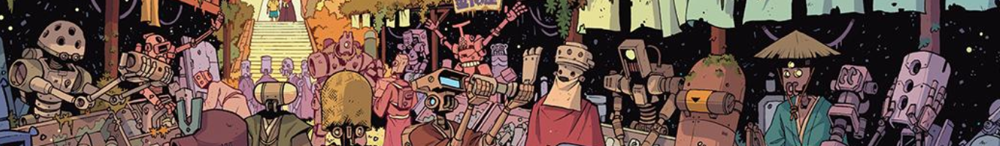

English version below

#### FR

Yojimbot est une BD de **Repos Sylvain** que j’ai beaucoup appréciée !

Ce projet m’a permis d’explorer plus en profondeur l’animation dans Unreal :

- Le replacement des pieds avec le Control Rig
- Les Montages
- Les Layers
- Les animations de hit en fonction de la position de l’attaque
- Le suivi de la tête du personnage avec des contraintes

J’ai également eu l’occasion d’expérimenter le système de “slice” d’objets.

Le projet continue d’évoluer; à l’origine, j’avais créé un système de combos simple, et aujourd’hui je développe un éditeur visuel permettant de concevoir des combos graphiquement.

#### EN

Yojimbot is a comic by **Repos Sylvain** that I really enjoyed!

This project allowed me to dive deeper into animation in Unreal:

- Foot placement using Control Rig
- Montages
- Layers
- Hit animations based on the attack’s position
- Character head tracking with constraints

I also had the chance to experiment with the object slicing system.

The project is still evolving; initially, I built a simple combo system, and now I’m working on a visual editor to design combos graphically.

---

- [Watch the video](https://www.youtube.com/watch?v=29FU2tA25Bw)
- [Project Repo](https://github.com/Opaax/Yojimbot_FanProject?tab=readme-ov-file)
- 👉 [Home](./).
